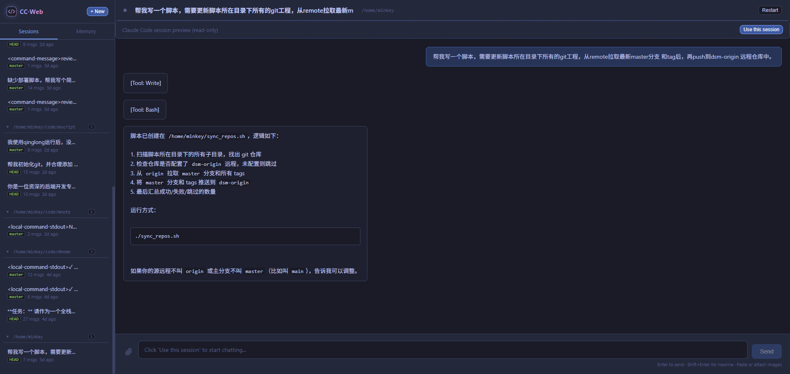

# claude-code-web-proxy

> 📖 **Languages:** [中文](../README.md) | [English](./README.en.md)

<p align="center">
  
</p>
<p align="center">
  
</p>

A web-based proxy for the Claude Code CLI — provides a browser UI to manage and run multiple Claude Code sessions concurrently.

## ✨ Highlights

- 🚀 **Zero-intrusion, drives the real Claude Code CLI** — this project is just a thin web shell over the `claude` binary. It **never proxies or rewrites conversation content** and never touches the Anthropic API directly. Whatever the CLI does locally is what runs — upgrading the CLI needs no changes here.
- 📂 **Session + Memory management in one place** — sidebar supports creating, switching, renaming, deleting and reconnecting sessions; the Memory panel groups files by project and lets you browse / edit / delete files under `~/.claude/`, with collapse state persisted across reloads.
- ⚡ **Parallel sessions, real productivity multiplier** — each session runs its own `claude` subprocess, so you can refactor in A, debug in B, and run tests in C simultaneously without any of them blocking each other.
- 🌐 **Network-friendly isolation** — put the Claude CLI and this proxy together in an isolated environment (VM or remote box) so the CLI's global proxy requirements stay fully decoupled from your host network and daily workflow.

## 🎯 Recommended setups

1. **Local VM** — run the `claude` CLI and `claude-code-web-proxy` inside a local VM with a global proxy enabled inside the VM. Host networking stays untouched; open the Web UI via the VM's IP. For code access, just use your VM's built-in **shared folders** (VirtualBox / VMware / Parallels, etc.) to mount the host project directory — no network protocol needed.
2. **Remote deployment** — deploy the CLI and this proxy to an overseas VPS or a remote dev box, and hit the Web UI from your browser. Two code-sync approaches: **network mount** (sshfs / SMB / NFS — mount the remote directory as if it were local, so your editor experience stays seamless), or bidirectional sync with git / rsync / mutagen. The network-mount approach also works for the VM scenario above.

> Both setups have been battle-tested over long periods — **no Claude account bans observed**. The key is running the CLI in a clean, consistent network environment instead of patching proxy rules on the host.

## Other features

- **Real-time streaming** — Stream Claude's replies, tool calls, and status updates over WebSocket.
- **Session persistence** — Messages and metadata are saved to disk and survive restarts.
- **Interactive permissions** — Multiple permission modes, including a Web popup for interactive approval via MCP.
- **Dark theme** — Tokyonight-inspired UI.

## Requirements

- **Node.js** 14+ (18+ recommended)
- **Claude Code CLI** installed and available on `PATH` (usually `~/.local/bin/claude`)

## Quick Start

### Install

```bash
git clone https://github.com/jiemi6/claude-code-web-proxy.git
cd claude-code-web-proxy
npm install
```

The project has a single runtime dependency (`ws`), so install is fast.

### Run

```bash
# Recommended (auto-configures PATH and installs deps)
./start.sh

# Or directly
npm start

# Dev mode (auto-reload on file changes)
npm run dev
```

Then open `http://localhost:8199` in your browser.

### Background Deployment

Use the bundled `deploy.sh` management script to run as a background service:

```bash
./deploy.sh start     # start in background (logs to app.log)
./deploy.sh status    # check status
./deploy.sh log       # tail logs
./deploy.sh restart
./deploy.sh stop
```

For auto-start on boot, a sample systemd unit:

```ini
# /etc/systemd/system/claude-code-web-proxy.service
[Unit]
Description=claude-code-web-proxy
After=network.target

[Service]
Type=simple
User=your-user
WorkingDirectory=/path/to/claude-code-web-proxy
ExecStart=/usr/bin/node backend/server.js
Environment=HOST=192.168.1.100  # your LAN IP, or omit for auto-detection
Environment=PORT=8199
Restart=on-failure

[Install]
WantedBy=multi-user.target
```

```bash
sudo systemctl daemon-reload
sudo systemctl enable --now claude-code-web-proxy
```

## Environment Variables

| Variable | Default | Description |
|----------|---------|-------------|
| `HOST` | auto-detected LAN IPv4 | Listen address (LAN-only by default; does **not** bind to `0.0.0.0`) |
| `PORT` | `8199` | Listen port |
| `CLAUDE_BIN` | auto-detect | Path to the Claude CLI binary |

Example:

```bash
HOST=127.0.0.1 PORT=3000 npm start
```

## Usage

### Create a session

1. Click **"New"** in the sidebar.
2. Enter a session name (optional — auto-generated if omitted).
3. Set the working directory (Claude will operate under this path).
4. Choose a permission mode.
5. Confirm to create.

### Permission modes

| Mode | Description |
|------|-------------|
| `bypassPermissions` | Skip all permission checks. Fastest, not safe. |
| `acceptEdits` | Auto-approve file edits. |
| `auto` | Smart risk-based classification. |
| `default` | Standard strict mode — sensitive ops require confirmation. |
| `mcp` | Interactive approval via Web popup. Recommended for fine-grained control. |

### Send messages

- Type in the bottom input box.
- **Enter** to send, **Shift+Enter** for a newline.
- Streaming replies and tool calls appear in real time.

### Interrupt

While Claude is processing, click the send button (which turns into an abort button) to interrupt.

### Browse & manage Memory files

Switch the sidebar to the **"Memory"** tab to view `.md`, `.json`, `.txt`, `.yaml` files under `~/.claude/`.

- **Grouped by project** — files are grouped by `projects/<slug>`, each group collapsible (state persisted to `localStorage`). Top-level files (e.g. `~/.claude/CLAUDE.md`) go into a **Global** group
- **Sorted by mtime** — most recently modified first; each item shows subpath, size, and relative time
- **Click an entry** — expand to view full content
- **✎ Edit** — open an inline editor; click Save to overwrite the file
- **× Delete** — delete the file (confirmation prompt, irreversible)

All write operations are restricted to `~/.claude/`; paths escaping the directory are rejected with 403.

## Architecture

```
claude-code-web-proxy/
├── backend/
│   ├── server.js              # HTTP/WebSocket server
│   ├── process_manager.js     # Claude subprocess management
│   ├── session_manager.js     # Session persistence
│   ├── permission_mcp.js      # MCP permission interaction service
│   └── data/sessions/         # Session data files
├── frontend/
│   ├── index.html             # Single-page app
│   └── static/style.css       # Styles
├── start.sh                   # Start script
└── docs/                      # Documentation (API.md, README.en.md, etc.)
```

### Core modules

**Server** — REST API + WebSocket service. Routes requests, serves static files, scans Memory files.

**Process Manager** — Runs one `claude` subprocess per session (`SessionRunner`). Uses an internal message queue so commands within a session execute in order. Parses Claude's `stream-json` output into structured events pushed to the frontend.

**Session Manager** — Saves session metadata and message history as JSON files under `backend/data/sessions/` for cross-restart persistence.

**Permission MCP Server** — Unix-socket-based MCP server. In `mcp` mode, it receives permission requests from Claude, forwards them to the Web frontend popup, and returns the user's decision back to Claude. 5-minute timeout.

### Data flow

```
User input → WebSocket → Server → ProcessManager → claude CLI subprocess
                                                          ↓
User UI ← WebSocket ← Server ← Event parser ← stream-json output
```

## API

Full API docs are in [API.md](./API.md). Common endpoints:

### REST API

```
GET    /api/sessions              # List all sessions
POST   /api/sessions              # Create a new session
GET    /api/sessions/:id/messages # Session message history
PUT    /api/sessions/:id/rename   # Rename a session
DELETE /api/sessions/:id          # Delete session and stop process
GET    /api/processes             # All running process status
GET    /api/memory                # List Memory files
GET    /api/memory/file?path=...  # Read a Memory file
PUT    /api/memory/file?path=...  # Save (overwrite) a Memory file
DELETE /api/memory/file?path=...  # Delete a Memory file
```

### WebSocket

Endpoint: `ws://<host>:<port>/ws/:sessionId`

**Client → Server:**

```json
{ "type": "message", "content": "your prompt" }
{ "type": "abort" }
{ "type": "permission_response", "id": "request-id", "allowed": true }
```

**Server → Client:**

```json
{ "type": "status", "busy": true }
{ "type": "system_init", "model": "claude-sonnet-4-6", "tools": 12 }
{ "type": "delta", "content": "streaming text chunk..." }
{ "type": "tool_use", "name": "Bash", "input": { "command": "ls" } }
{ "type": "result_text", "content": "final reply" }
{ "type": "meta", "total_cost_usd": 0.05, "duration_ms": 3200, "num_turns": 2 }
{ "type": "done" }
```

## Session data format

Each session is stored as `backend/data/sessions/{uuid}.json`:

```json
{
  "id": "e6cf52ba-5b16-4c18-ad9d-d7ad61148714",
  "name": "My project",
  "createdAt": 1773115029038,
  "updatedAt": 1773121943159,
  "workingDir": "/home/user/project",
  "permissionMode": "bypassPermissions",
  "messages": [
    { "role": "user", "content": "list files", "timestamp": 1773115033448 },
    { "role": "assistant", "content": "Here are the files...", "timestamp": 1773115053912 }
  ]
}
```

## FAQ

**Q: `claude` command not found?**

Make sure the Claude Code CLI is installed. You can point to it explicitly with `CLAUDE_BIN`:

```bash
CLAUDE_BIN=/path/to/claude npm start
```

**Q: How do I change the port?**

```bash
PORT=3000 npm start
```

**Q: Where is session data stored?**

Under `backend/data/sessions/`, one JSON file per session. Delete the file to remove a session.

**Q: Does it support multiple users?**

Currently single-user. Multiple browser tabs can connect to the same session, but they share a single Claude process.

## License

MIT
